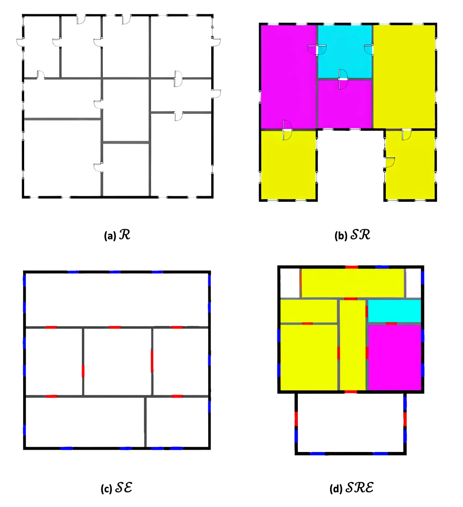
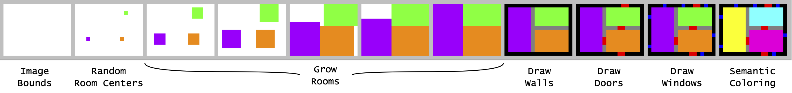
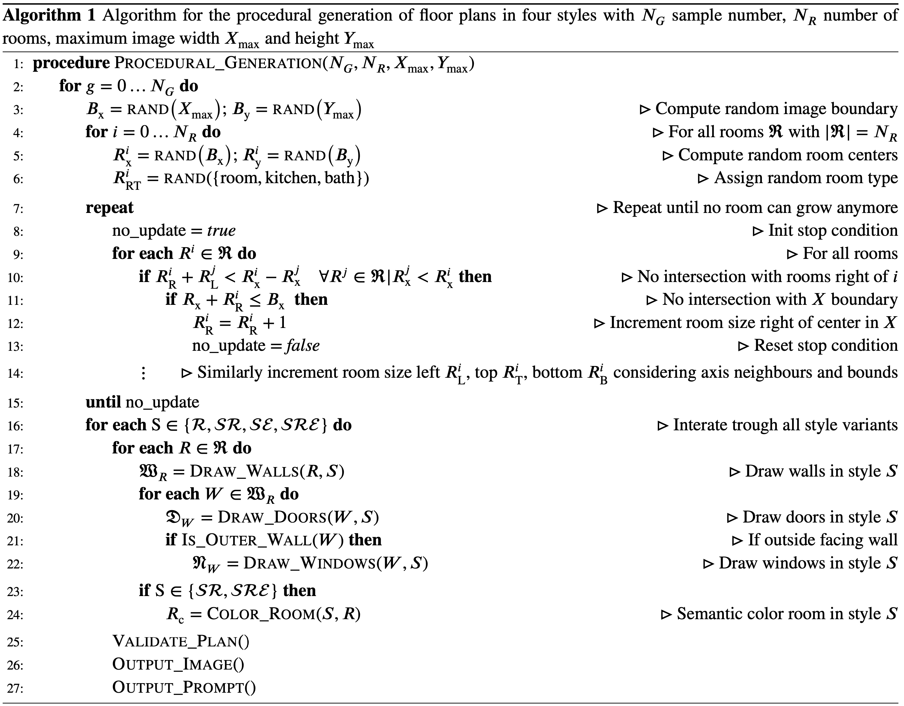

# Overview

The code is used to generate semantically encoded training data of floor plans for stable diffusion. The algorithm and approach is described in the paper "Diffusion models for computational design at the example of floor plans" in Civil Engineering Design.


# Model Types

We propose a novel approach to encode these semantics in floor plans to improve the fine-tuning of diffusion models utilizing the following three strategies:
- Simplify:	The more different semantics a floor plan contains, the harder it is for the diffusion model to differentiate between them. Thus, it is important to remove unnecessary elements (furniture, assets, etc.) and focus on the semantics relevant for floor planning (walls, doors, and windows). The removed unnecessary elements may be added in a following in-painting step in the section editing step from Fig. 2. This strategy will be our baseline for the retraining of model B, which will be called R (Reduced).
- Encode:	When we look at a floor plan, we know that thick lines are walls, and the enclosed white space is a room. We also understand its semantic function (kitchen, bed room, living room) from the symbols of appliances that it contains (oven/fridge, bed, couch). When we remove those symbols—to simplify the model—the diffusion model (and we) cannot gain understanding about these semantics from the image. Thus, we need a way to re-encode this information, for example by filling the rooms with different colours, like cyan for bathrooms, yellow for bed/living rooms, or magenta for kitchens. We call this semantic colouring of rooms SR.
- Contrast:	Floor plans are often black and white (BW) and diffusion models are designed to encode colour images. Thus, we lose lots of information capacity by just training them on black and white images. We already used colours to encode room semantics in the last step. The question then is whether we can further simplify the floor plans by replacing the symbols for doors and windows with colours instead. We call this semantic colouring of elements SE. The combined semantic encoding of room and elements is the SRE model.

The code can generate training examples in four variants



- $R$: Unencoded floor plans
- $SR$: Semantically encode room type
- $SE$: Semantically encode doors and windows
- $SRE$: Semantically encode door, windows and room types

# Algorithm

The floor-plan generation algorithm is based on random room locations that are grown into rectangular regions until their edges collide with the edges and corners of other regions. 



A visual representation of the algorithm for one of the styles is shown in the Figure above and a description of the entire algorithm in simplified pseudocode is shown in Algorithm 1. 



Line 1–6 and images 1 and 2 show the setting of image bounds and the random selection of initial room coordinates. The process of growing the rooms is given in line 8–14 and images 3–7. The rooms grow in each direction (left $𝑅_L$, right $𝑅_R$, top $𝑅_T$, bottom $𝑅_B$)
until they either intersect with another room or the image boundary. In lines 16–24 and images 8–11 we add walls, doors, and windows. Doors and windows are placed according to the simple rule that outside walls will often have a door flanked by two windows, 
while interior walls will only have one door. However, for every step and every element there is a chance for random alterations, such as the deletion of rooms or walls to create non-rectangular building arrangements. During this process we also render one 
variant of the plan for each style. Once the final plans are created, they are automatically checked for obvious errors and either fixed or discarded if necessary. This creates a collection of valid plans, ren-dered in the four different styles and labelled 
automatically. This final step is shown in lines 25–27. Afterwards, there is also a manual process of discarding any erroneous plans that the automated validation step did not catch, and of labelling additional aspects that would be challenging to automatically recognize, 
such as the general shape of the building (e.g. l-shape, o-shape, etc.).

# Reference

```bibtex
@article{ploennigs2024diffusion,
  title={Automating Computational Design with Generative AI},
  author={Ploennigs, Joern and Berger, Markus},
  journal={Civil Engineering Design},
  note={arXiv preprint arXiv:2307.02511},
  year={2024}
}
```
